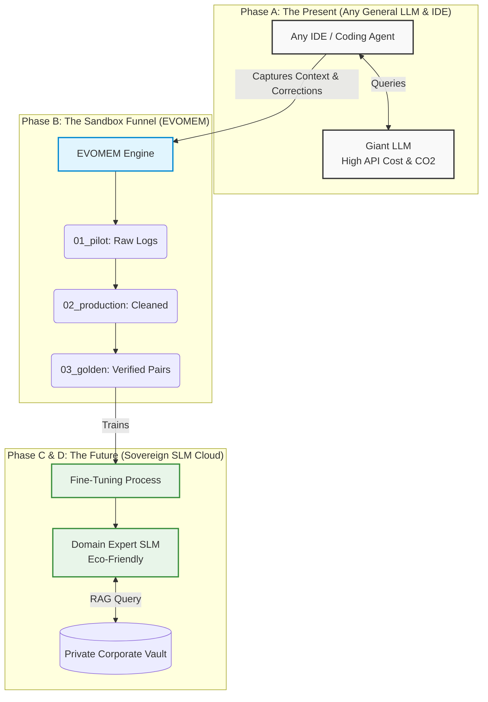

# AMK (Agent Memory Kit) 
**Powered by the EVOMEM Engine**


## 🦋 An Invention with Soul: The AMK Legacy

> *"From conserving water in the physical world to conserving energy in the digital plane of AI."*

For years, my life was dedicated to designing eco-efficient inventions in the physical world. Today, I take the most important step of my career: bringing the laws of eco-efficiency into the core of software and Artificial Intelligence. 

**AMK** stands for **A**my, **M**ariposa, and **K**ori. This open-source project is a profound technological legacy, built in eternal memory of my beloved wife, Eliana Arenas Cano ("La Mariposa"), who passed away on March 31, 2025, and dedicated to our children, Amy and Kori.

It is a guardian of memory. It was born from heartbreak, engineered through love, and designed for the highest level of global professional innovation. AMK proves that technology can be deeply human, saving not just developer time, but actively protecting the planet our children will inherit.
## The IDE Context Regression Problem

In software engineering, a common problem when using AI coding assistants is **IDE Context Regression**: when you fix Module A, the AI loses the context of Module B and breaks it. LLMs lack persistent memory between sessions—they start from scratch based only on what they see in the current window.

**AMK** solves this through its internal engine, **EVOMEM (Evolutionary Memory System)**. It acts as the institutional memory of your project, representing **RLHF (Reinforcement Learning from Human Feedback) democratized for small teams with conventional IDEs.** 

If you fixed an OCR module three weeks ago that changed how dates are formatted, and today you ask the AI to fix the forecast module, AMK ensures the AI "remembers" that OCR constraint and doesn't break it. 

## The 3-Layer Architecture

The system is built on three interconnected layers:

1. **Layer 1 — Interaction Memory:** Captures every prompt and response from the agent with its outcome (correct, corrected, rejected). This forms the foundation of the Golden Dataset.
2. **Layer 2 — Code Evolution Memory:** Captures every code change and its context: what module changed, why, what was wrong, how it was fixed, and *which other modules might be affected*.
3. **Layer 3 — Regression Intelligence:** A deterministic dependency analysis. Every time code changes, it cross-references Layer 2 to see if previous corrections are impacted, generating a preemptive alert before the IDE breaks them.

## The Agnostic AI Factory Architecture

To truly democratize AI, EVOMEM acts as the universal bridge between costly, generic LLMs and private, highly-efficient SLMs.



### 🔮 Why SLMs are the Definitive Future
The industry is experiencing a paradigm shift. While giant LLMs are excellent for general reasoning and prototyping (Phase A), they are unsustainable for massive production. **Small Language Models (SLMs)** represent the future of enterprise software development because:
1.  **Absolute Specialization:** An SLM trained exclusively on your Golden Dataset becomes a domain expert. It doesn't need to know Shakespeare to validate an invoice.
2.  **Privacy and Sovereignty:** They can run entirely on your private infrastructure (or locally on edge devices), ensuring that your proprietary data never touches a public API.
3.  **Ultra-Low Latency:** Smaller parameter sizes mean lightning-fast response times, essential for real-time applications.

## 🌱 Why Green AI? (Economic, Environmental, and Social Impact)

Training massive LLMs consumes staggering amounts of energy. AMK champions the **Green AI** vision by creating high-quality, domain-specific "Golden Datasets" used to train **SLMs (Small Language Models)**. These SLMs are highly specialized, run efficiently on edge devices, and drastically reduce the environmental cost of AI.

Research shows that **a single massive AI query emits ~4.3 grams of CO₂** (20x more than a normal web search) and **every 10-50 queries consume a 500ml bottle of fresh water** for data center cooling. 

When your AI Coding Assistant suffers from "Context Regression" and forces you to ask 15 redundant questions to fix the same bug, we are literally pouring water and emissions down the drain. EVOMEM intercepts this waste through the Sustainable Trinity:

*   **💼 Economic Impact (Profit):** Eliminates thousands of redundant API calls today. Tomorrow, deploying your own SLM drops inference costs to near-zero and completely eliminates vendor lock-in.
*   **🌍 Environmental Impact (Planet):** By giving the IDE local memory, you save a bottle of fresh water and grams of CO2 every time you avoid a redundant prompt. An SLM running on optimized hardware radically shrinks this carbon footprint.
*   **🤝 Social Impact (People):** Democratizes advanced training (RLHF) so any small team can build their sovereign, eco-friendly AI, leaving a sustainable technological legacy.
## Installation

```bash
pip install evomem
```

## Quickstart

```python
from evomem import InteractionMemory, CodeEvolutionMemory, RegressionIntelligence

# 1. Initialize memory tracker (Layer 1)
memory = InteractionMemory(session_id="dev-session-001")

# 2. Track a code evolution event (Layer 2)
code_evo = CodeEvolutionMemory()
code_evo.track_evolution(
    original_code="def read_date(text): return text",
    improved_code="def read_date(text): return text.replace('-', '/')",
    reason="Fixed OCR date format issue. Forecast module relies on this format.",
    file_path="ocr_module.py",
    affected_modules=["forecast_module.py"]
)

# 3. Check for regressions before making new changes (Layer 3)
reg_intel = RegressionIntelligence()
alerts = reg_intel.check_regression_risk("forecast_module.py")
print("Alerts before changing forecast:", alerts)
```

## Dataset Roadmap

1. **Piloto:** Raw, uncurated data capture from IDE sessions.
2. **Producción:** Cleaned interaction logs with valid metadata.
3. **Golden Dataset:** Rigorously verified pairs featuring the highest quality code evolutions.
4. **SLM (Small Language Model):** Specialized, fine-tuned lightweight models trained on the Golden Dataset.

## Contributing
We welcome contributions! Please see [CONTRIBUTING.md](CONTRIBUTING.md).

## Credits
- **Creator & Architect**: Andrés Salazar Quintero
- **In Memory Of**: Eliana Arenas Cano ("La Mariposa")
