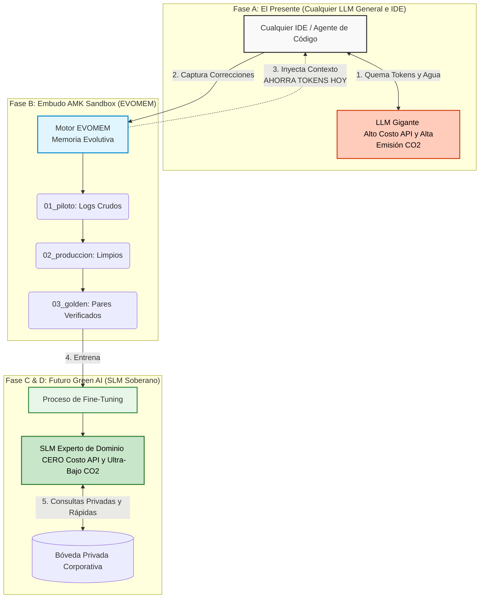

# AMK (Agent Memory Kit)
**Potenciado por el motor EVOMEM**


## 🦋 Una Invención con Alma: El Legado AMK

> *"De conservar agua en el mundo físico, a conservar energía en el plano digital de la IA."*

Durante años, me dediqué al diseño de invenciones ecoeficientes en el mundo físico. Hoy, doy el paso más importante de mi carrera: llevar las leyes de la ecoeficiencia al núcleo del software y la Inteligencia Artificial.

**AMK** significa **A**my, **M**ariposa y **K**ori. Este proyecto de código abierto es un profundo legado tecnológico, construido en memoria eterna de mi amada esposa, Eliana Arenas Cano ("La Mariposa"), quien partió el 31 de marzo de 2025, y dedicado a nuestros hijos, Amy y Kori.

Es un guardián de la memoria. Nació del dolor, fue esculpido con amor y diseñado con el máximo rigor de la innovación profesional global. AMK demuestra que la tecnología puede ser profundamente humana, ahorrando no solo horas de desarrollo, sino protegiendo activamente el planeta que heredarán nuestros hijos.
## El Problema de la Regresión de Contexto en el IDE

En la ingeniería de software, un problema común al usar asistentes de IA es la **regresión de contexto del IDE**: cuando corriges el módulo A, la IA pierde el contexto del módulo B y lo rompe. Los LLMs no tienen memoria persistente entre sesiones; empiezan desde cero con lo que ven en la ventana actual.

**AMK** resuelve esto a través de su motor interno **EVOMEM (Evolutionary Memory System)**. Actúa como la memoria institucional de tu proyecto y representa el **RLHF (Reinforcement Learning from Human Feedback) democratizado para equipos pequeños con IDEs convencionales.**

Si hace tres semanas corregiste un módulo de OCR que cambió el formato de las fechas, y hoy le pides a la IA que arregle el módulo de pronóstico (forecast), AMK se asegura de que la IA "recuerde" la restricción del OCR y no la rompa. El dataset evolutivo se convierte en la memoria que el IDE no tiene nativamente.

## La Arquitectura de 3 Capas

El sistema se basa en tres capas interconectadas:

1. **Capa 1 — Interaction Memory:** Captura cada pregunta y respuesta del agente con su resultado (correcto, corregido, rechazado). Esto forma la base del Dataset Dorado.
2. **Capa 2 — Code Evolution Memory:** Captura cada cambio de código y su contexto: qué módulo cambió, por qué, qué estaba mal, cómo se corrigió y *qué otros módulos podrían verse afectados*.
3. **Capa 3 — Regression Intelligence:** Un análisis determinístico de dependencias. Cada vez que hay un cambio, cruza la información con la Capa 2 para ver si correcciones anteriores se ven afectadas, generando una alerta antes de que el IDE las rompa.

## La Arquitectura: La Fábrica de IA Agnóstica

Para democratizar verdaderamente la IA, EVOMEM actúa como el puente universal entre los costosos LLMs genéricos y los SLMs privados de altísima eficiencia.



### 🔮 ¿Por qué los SLMs son el Futuro Definitivo?
La industria está viviendo un cambio de paradigma. Mientras que los LLMs gigantes son excelentes para prototipar y para razonamiento general (Fase A), son insostenibles para producción masiva. Los **Small Language Models (SLMs)** representan el futuro ineludible del desarrollo empresarial porque:
1.  **Especialización Absoluta:** Un SLM entrenado exclusivamente con tu *Dataset de Oro* se vuelve un experto en tu dominio. No necesita saber de literatura clásica para validar una factura.
2.  **Privacidad y Soberanía:** Pueden ejecutarse completamente en tu infraestructura privada (o localmente en dispositivos edge), garantizando que tus datos jamás toquen una API pública.
3.  **Latencia Ultra-Baja:** Su menor tamaño permite tiempos de respuesta casi inmediatos, algo vital para sistemas en tiempo real.

## 🌱 ¿Por qué Green AI? (Impacto Económico, Ambiental y Social)

Entrenar LLMs masivos consume cantidades asombrosas de energía. AMK defiende la visión de **Green AI** creando "Golden Datasets" de alta calidad y dominio específico usados para entrenar **SLMs (Small Language Models)**. Estos SLMs son especializados, corren en dispositivos edge y reducen drásticamente el costo ambiental.

Estudios recientes demuestran que **una sola consulta a una IA gigante emite ~4.3 gramos de CO₂** (20 veces más que una búsqueda web normal) y que **por cada 10 a 50 consultas se evapora una botella de 500ml de agua dulce** para enfriar los servidores de los centros de datos.

Cuando tu Asistente de Código sufre de "Regresión de Contexto" y te obliga a pedirle 15 veces que arregle el mismo error, estamos literalmente botando agua dulce y emitiendo carbono a la basura por un cálculo redundante. EVOMEM intercepta este desperdicio masivo a través de la Trinidad Sostenible:

*   **💼 Impacto Económico (Rentabilidad):** Elimina miles de llamadas a APIs redundantes hoy. Mañana, al desplegar tu propio SLM, reduces los costos de inferencia a casi cero, logrando independencia tecnológica absoluta (cero *Vendor Lock-in*).
*   **🌍 Impacto Ambiental (Planeta):** Al darle memoria local al IDE, ahorras una botella de agua y decenas de gramos de CO2 cada vez que evitas un prompt repetitivo. Al migrar a un SLM en hardware optimizado, la huella de carbono se encoge exponencialmente.
*   **🤝 Impacto Social (Personas):** Democratiza el entrenamiento avanzado (RLHF) para que cualquier equipo pequeño construya su IA soberana y ecológica, dejando un legado tecnológico sostenible.
## Instalación

```bash
pip install evomem
```

## Inicio Rápido (Quickstart)

```python
from evomem import InteractionMemory, CodeEvolutionMemory, RegressionIntelligence

# 1. Inicializar rastreador (Capa 1)
memory = InteractionMemory(session_id="dev-session-001")

# 2. Registrar evento de evolución (Capa 2)
code_evo = CodeEvolutionMemory()
code_evo.track_evolution(
    original_code="def read_date(text): return text",
    improved_code="def read_date(text): return text.replace('-', '/')",
    reason="Arreglado el formato de fecha del OCR. Forecast depende de esto.",
    file_path="ocr_module.py",
    affected_modules=["forecast_module.py"]
)

# 3. Prevenir regresiones (Capa 3)
reg_intel = RegressionIntelligence()
alertas = reg_intel.check_regression_risk("forecast_module.py")
print("Alertas antes de modificar forecast:", alertas)
```

## Hoja de Ruta del Dataset (Roadmap)

1. **Piloto:** Captura en crudo.
2. **Producción:** Registros limpios con metadatos.
3. **Golden Dataset:** Pares rigurosamente verificados.
4. **SLM:** Modelos ligeros especializados.

## Cómo Contribuir
¡Agradecemos las contribuciones! Revisa [CONTRIBUTING.md](CONTRIBUTING.md).

## Créditos
- **Creador y Arquitecto**: Andrés Salazar Quintero
- **En Memoria De**: Eliana Arenas Cano ("La Mariposa")
