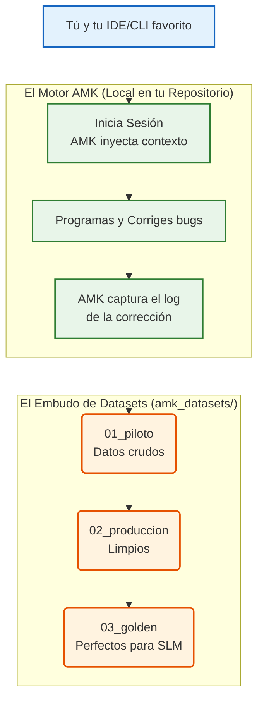

# 🦋 Whitepaper AMK (Agent Memory Kit): El Manual del Desarrollador

*De conservar agua en el mundo físico, a conservar energía en el plano digital.*

Bienvenido a **AMK (Agent Memory Kit)**. Este documento está diseñado para explicarte, de forma sencilla y con analogías claras, **qué es, por qué lo necesitas, y cómo integrarlo** en tus proyectos, sin importar qué IDE o CLI utilices.

---

## 1. El Problema: El "Día de la Marmota" Digital (Regresión de Contexto)

Imagina que contratas a un asistente brillante pero con memoria de corto plazo. Le explicas durante horas cómo funciona la arquitectura de tu casa para que arregle una tubería en la cocina (Módulo A). Lo hace perfecto. Al día siguiente, le pides que arregle la tubería del baño (Módulo B). Como olvidó todo sobre la cocina, rompe el tubo principal y te inunda la casa. 

Esto es exactamente lo que pasa hoy con asistentes como Claude Code, Cursor o Gemini en tu IDE. Cada nueva sesión, empiezan desde cero. Pierden el contexto de las reglas que ya habías corregido semanas atrás. Esto se llama **Regresión de Contexto**.

### El Desperdicio Masivo (Tokens, Agua y CO2)
Cada vez que el asistente rompe algo que ya habías arreglado, te obliga a hacer 5 o 6 *prompts* adicionales ("No, recuerda que la fecha es DD/MM, no MM/DD"). 
*   **A nivel económico:** Estás quemando miles de **tokens de entrada** (re-explicando el contexto) y **tokens de salida** (regenerando código erróneo) de forma redundante.
*   **A nivel ambiental:** Procesar esos tokens redundantes en modelos gigantes (LLMs) requiere servidores masivos. Se calcula que repitiendo este ciclo, los desarrolladores evaporan silenciosamente **botellas enteras de agua dulce** (enfriamiento de Datacenters) y emiten **gramos de CO2** por errores que la IA *ya debería saber*.

---

## 2. La Solución: ¿Qué es AMK?

**AMK (Agent Memory Kit)** es el antídoto contra la amnesia de tu Inteligencia Artificial. Es un "Kit" ligero que instalas en tu repositorio y que actúa como un guardián de la memoria.

Está impulsado por un motor interno llamado **EVOMEM**, que funciona en dos líneas de tiempo:

### ⏳ El Presente: Memoria Persistente (Ahorro inmediato de Tokens)
Al usar AMK, cada vez que corriges un error con tu asistente, AMK lo anota en una libreta inteligente (`04_code_evolution`). La próxima vez que abras tu IDE, AMK inyecta automáticamente un pequeño resumen de las reglas cruciales. 
*   **Resultado:** El asistente ya no comete el error de novato. Te ahorras miles de tokens porque no tienes que volver a cargar o re-explicar archivos de contexto gigantes.

### 🚀 El Futuro: El Dataset de Oro y los SLMs
Cada interacción correcta que tienes en tu CLI o IDE se guarda y se limpia en un embudo de 3 pasos (`01_piloto` -> `02_produccion` -> `03_golden`).
*   **Resultado:** Al final del mes, tienes un "Dataset de Oro" perfecto. Con él, tu empresa puede entrenar su propio modelo pequeño (**SLM - Small Language Model**). Un SLM corre localmente, su costo de inferencia (tokens) es **CERO**, y consume una fracción ínfima de energía. Es la máxima expresión del *Green AI*.

---

## 3. Mapa de Integración (El Flujo Agnóstico)

AMK no está atado a Cursor, ni a Anthropic, ni a Antigravity. Es **agnóstico**. Si tu CLI o IDE puede ejecutar comandos de terminal o leer archivos de tu carpeta, puedes usar AMK.



---

## 4. ¿Cómo instalarlo y usarlo? (Para Desarrolladores)

Integrar AMK es tan fácil como importar una librería en Python.

### Paso 1: Instalación
En la raíz de tu proyecto, instala la librería (próximamente en PyPI):
```bash
pip install evomem
```

### Paso 2: Inicializa el Kit en tu flujo
Crea un script (por ejemplo `amk_tracker.py`) que tu agente de IA o tú puedan llamar cuando ocurre un cambio importante:

```python
from evomem import CodeEvolutionMemory, RegressionIntelligence

# Inicializa AMK. Esto creará automáticamente la carpeta 'amk_datasets/'
memory = CodeEvolutionMemory()

# Cuando la IA o tú arreglen un bug importante, regístralo:
memory.log_correction(
    module_name="api/facturacion.py",
    what_broke="La IA estaba enviando fechas en MM/DD",
    root_cause="Falta de contexto sobre estándar LATAM",
    fix_applied="Se forzó el parseo a DD/MM/YYYY",
    affected_modules=["api/reportes.py"],
    warning_for_ide="CRÍTICO: Cualquier módulo que llame a facturación DEBE usar formato DD/MM/YYYY."
)

print("Memoria guardada en amk_datasets/04_code_evolution/")
```

### Paso 3: Prevención (El "Escudo")
Antes de que tu agente modifique un archivo, puedes hacer que revise si hay "minas terrestres":

```python
shield = RegressionIntelligence()
alertas = shield.check_regression_risk("api/reportes.py")
print("Cuidado IA, ten en cuenta esto antes de programar:", alertas)
```

## Conclusión

Integrar AMK no es solo una buena práctica de ingeniería para no volverte loco repitiendo prompts. Es una declaración de principios corporativos. Al detener la regresión de contexto:
1. **Salvas tu Dinero:** Eliminando el consumo innecesario de Tokens.
2. **Salvas tu Código:** Previendo que la IA rompa dependencias pasadas.
3. **Salvas el Planeta:** Interceptando el gasto silencioso de agua y CO2 en los Datacenters del mundo.
