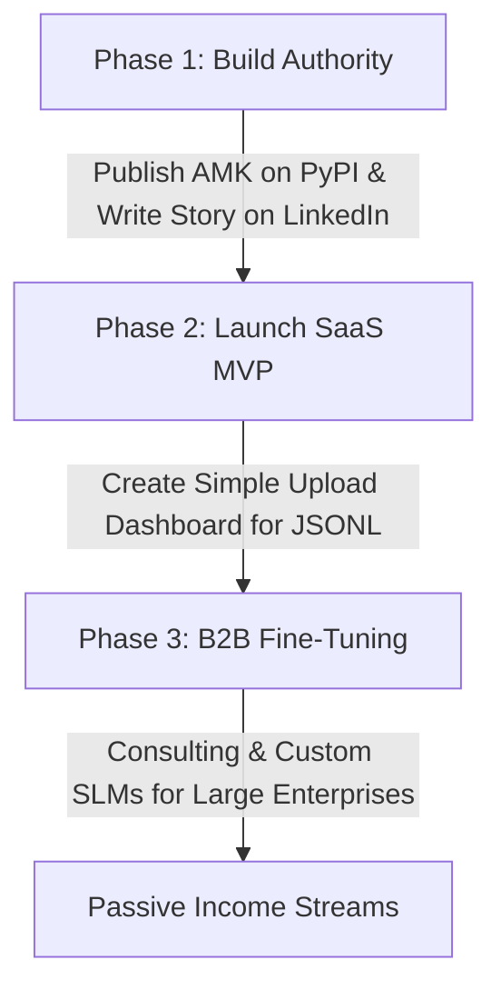

# 💰 AMK & EVOMEM Monetization & Growth Strategy

This document outlines the strategic commercial roadmap for **AMK (Agent Memory Kit)** and its underlying **EVOMEM** engine. Developed by Andrés Salazar Quintero, this framework is positioned to solve a multi-billion dollar problem in AI engineering: **IDE Context Regression** and **Domain-Specific SLM Data Bottlenecks**.

---

## 🚀 The Multi-Billion Dollar Problem
Every software company using AI coding assistants suffers from **Context Decay** and **Context Regression**. 
1. **Context Decay**: AI forgets past corrections, repeating the same mistakes over long sessions.
2. **Data Scarcity**: Companies want to train small, cost-efficient, private models (SLMs), but they do not have high-quality, sanitized data to do so.

**AMK** solves both by turning daily interactions into an evolutionary repository of institutional memory.

---

## 🗺️ Step-by-Step Monetization Blueprint

### 🌟 Step 1: The "Open-Core" Model (The Hook)
Keep the core framework **100% open-source (MIT)** on GitHub to drive massive developer adoption.
* **Free Tier (AMK Core)**: Developers install it via `pip install evomem`. They track their local sessions, save logs to JSONL, and prevent context regression locally on their machines.
* **Why this works**: Developers love free tools. They will become your brand advocates, talking about AMK on Reddit, Twitter, and LinkedIn, raising your professional profile.

### 🔌 Step 2: Enterprise Cloud Adapters (The SaaS Bridge)
While local developers are fine with JSONL files, **enterprises** need security, compliance, and cloud integrations. This is where you charge.
* **Premium Exporters (Paid)**: Charge a license for closed-source modules that securely stream evolutionary logs directly into corporate data lakes (Snowflake, Databricks, BigQuery).
* **Compliance & DLP Guardrails**: Implement automated redaction of sensitive credentials, keys, and PII before exporting data to fine-tuning engines.

### 📊 Step 3: "Regression Intelligence" Cloud Dashboard (SaaS Subscription)
Build a simple, beautiful cloud-hosted dashboard where tech leads and CTOs can monitor their team's code evolution.
* **The Product**: Teams upload their `corrections_log.jsonl` (or stream it via the Premium Exporters). Your web platform analyzes their codebase.
* **What they pay for**:
  * **Brittle Code Alerting**: Visualizes which parts of their proprietary software are constantly breaking or being refactored.
  * **SLM Readiness Score**: Predicts exactly when they have enough "Golden Pairs" to train a custom model and stop paying expensive OpenAI/Anthropic API bills.
* **Pricing model**: Free for up to 3 developers; **$49 to $199/month** for engineering teams.

### 🧠 Step 4: Small Language Model (SLM) Fine-Tuning Service (High-Ticket B2B)
Use the software you created to offer a high-value service.
* **The Offer**: You help corporations train private, lightweight, custom-tuned LLMs (like Gemma-2B, Phi-3, or Llama-8B) on their own codebases using the Golden Datasets gathered by AMK.
* **The Value Pitch**: *"Stop sending your proprietary code to external APIs. Let's train a 2-billion parameter model that runs on your local laptops, understands your exact database schemas, and costs $0 in API query fees."*
* **Why this works**: Companies will easily pay **$5,000 to $20,000** for a custom model training project, establishing you as a world-class AI Architect.

---

## 📈 3-Phase Action Plan to Launch and Scale

### 🔹 Phase 1: Authority & Traction (Month 1-2)
1. **Publish to PyPI**: Make the project installable with a single command (`pip install evomem`).
2. **The "Mariposa" Story Launch**: Write a viral post on LinkedIn explaining the architecture of AMK, the vision of Green AI, and the personal tribute behind the name. This builds trust, respect, and organic reach.
3. **Interactive Demos**: Record a 2-minute Loom video showing how `SessionStart.sh` reads the context and prevents code regressions.

### 🔹 Phase 2: SaaS Validation (Month 3-6)
1. Build a basic web portal where developers can drag-and-drop their `corrections_log.jsonl` to see their "Engineering Health Score".
2. Integrate a subscription checkout (like Stripe) to unlock Team Workspaces and compliance sanitizers.

### 🔹 Phase 3: Scaling & Distillation (Month 6+)
1. Pitch your custom SLM training services to companies. Use the "ZER Sandbox" as your stellar proof of concept.
2. Hire junior developers to handle maintenance while you focus on high-ticket architecture consulting.
